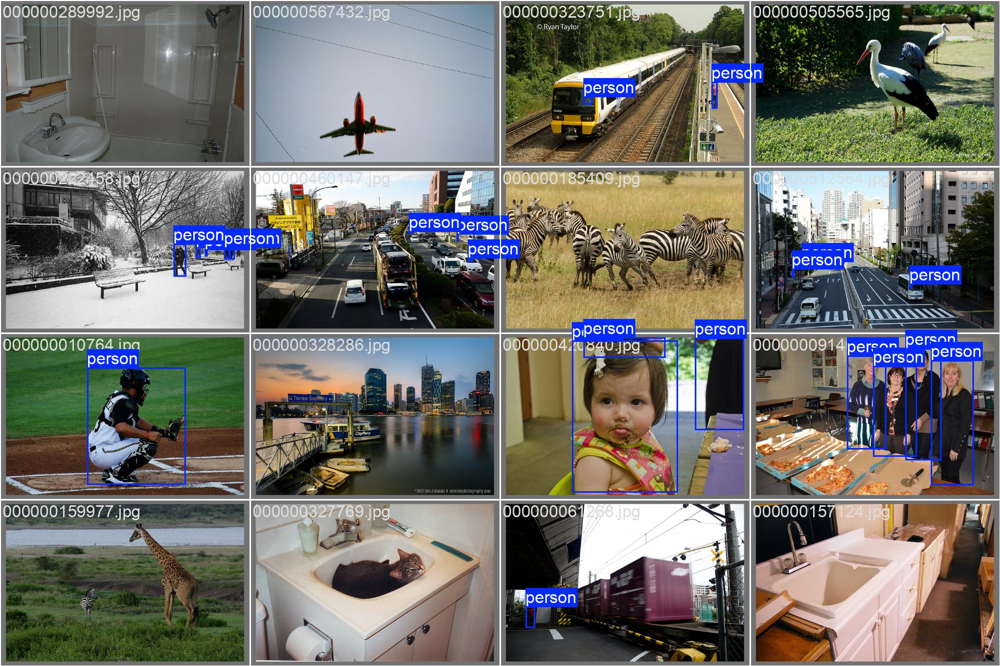
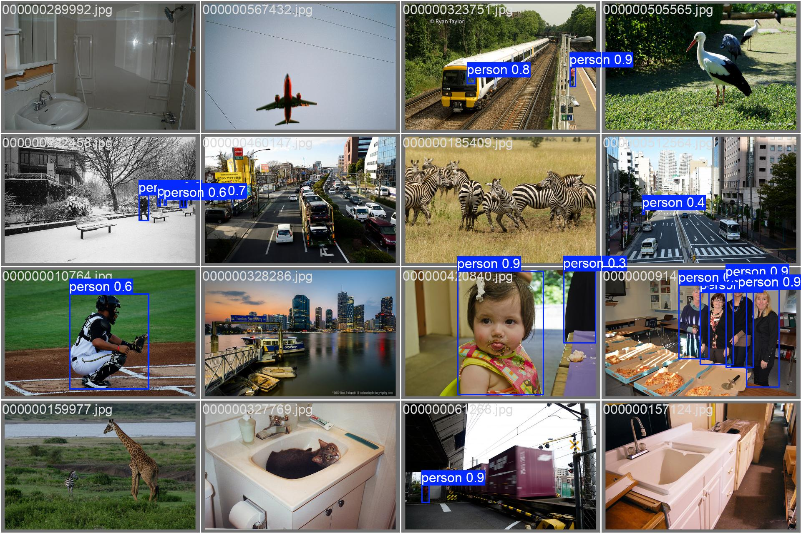
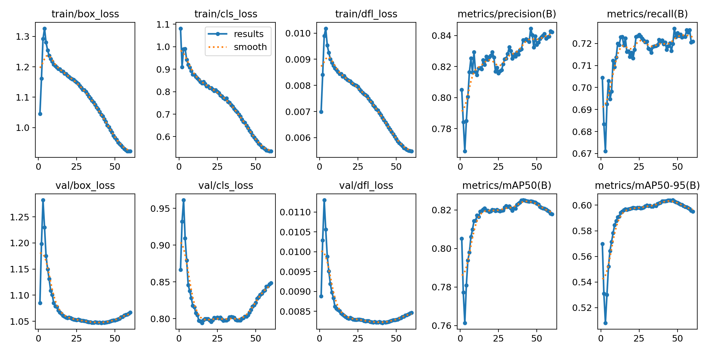

Here is a highly professional, comprehensive `README.md` for your project. It highlights both the heavy AI engineering you did on the cloud GPU and the highly optimized software architecture you built for the local dashboard.

You can copy and paste this directly into your `README.md` file. Just remember to replace the `[INSERT ... HERE]` placeholders with your actual images and video links!

---

# 👁️ Vision-Track: Real-Time Person Detection, Tracking & Counting

## 🎯 Project Overview & Goals

**Vision-Track** is a production-grade Computer Vision pipeline designed for real-time person detection, unique identity tracking, and foot-traffic analytics.

The goal of this project was to build a complete end-to-end AI system: starting from heavy data engineering and distributed cloud training, all the way down to a highly optimized, low-latency edge application. The system takes raw video feeds (live webcams or offline MP4s), detects humans with high confidence, assigns persistent IDs to them, and counts the total number of unique visitors using a localized Streamlit dashboard.

---

## 🚀 Architecture & Development Pipeline

### Phase 1: Dataset Engineering (The COCO Challenge)

To ensure the model could handle complex real-world environments, we utilized the massive **60 GB COCO Dataset**.

* **Data Extraction & Formatting:** Extracted all images containing the 'person' class and converted the bounding box annotations into the standardized YOLO format.
* **Background Distribution:** We specifically engineered the dataset to include exactly **10% background images** (images with no people). This is a crucial ML technique to train the model to recognize "nothing" and heavily reduce false-positive detections.
* **Edge-Case Training:** COCO provides incredibly difficult training scenarios. The dataset includes edgy images such as partial human bodies, hands, reflections of people in mirrors, and highly dense crowd scenes. Training on this data ensures the model performs reliably across vastly different situations.

### Phase 2: Cloud Model Fine-Tuning

We chose the **YOLO26 (Medium)** architecture for the perfect balance between inference speed and detection accuracy.

* **Transfer Learning Strategy:** We froze the first 10 layers (the backbone feature extractors) and retrained the remaining head layers to focus strictly on human detection.
* **Compute Power:** The model was trained using PyTorch and CUDA on a high-end cloud VM equipped with an **NVIDIA RTX 5090 (32 GB VRAM)** and an **AMD EPYC 9J14 CPU (48 Cores, 129 GB RAM)**.
* **Training Specs:** The model was trained for 60 epochs. The final output layer provide bounding box coordinates alongside the probability confidence score of the object being human.

#### 📊 Training vs. Validation Predications

> *Below: Examples from our validation batch labels compared to the model's actual predictions.*

    

    

### Phase 3: Evaluation & Edge Optimization

After training, the model was rigorously evaluated against standard object detection metrics to ensure production readiness:

* **Metrics Tracked:** Precision, Recall, F1-Score, and Mean Average Precision (mAP).

    

* **ONNX Export:** Once the F1 and mAP hit optimal thresholds, the raw PyTorch weights were exported and quantized into the **ONNX (`.onnx`)** format. This decoupling allows the model to run at maximum FPS on local edge hardware (CPU or GPU) without requiring massive 3GB Deep Learning libraries.

### Phase 4: The Analytics Dashboard

The final inference engine is wrapped in a high-speed, zero-latency **Streamlit** dashboard.

* **BoT-SORT Tracking:** We integrated the BoT-SORT tracking algorithm with a 120-frame memory buffer. This ensures that if a person walks behind an object and reappears, the system remembers their unique ID instead of double-counting them.
* **ROICounter Logic:** A custom counting class that maintains a mathematical `set()` of unique tracking IDs, ensuring precise cumulative foot-traffic counting.
* **Telemetry:** The UI displays bounding boxes, visual movement trails, unique ID tags, confidence percentages, and live system metrics (Pipeline FPS & Inference Latency).

#### 🎥 Dashboard Demo

> *Below: The Streamlit dashboard running real-time tracking and cumulative analytics.*

---

## ⚙️ How to Run Locally

### 1. Requirements

Ensure you have Python 3.11+ installed. We use `poetry` for dependency management. If you have an NVIDIA GPU, ensure your drivers are up to date.

### 2. Installation

Clone the repository and install the lightweight local environment:

```bash
git clone https://github.com/yourusername/vision-track.git
cd vision-track

# Install dependencies (We use onnxruntime-gpu for optimized NVIDIA inference)
poetry install

```

### 3. Launch the Dashboard

Run the Streamlit application. The UI will automatically pop up in your default web browser.

```bash
poetry run streamlit run app.py

```

* Select **Upload Video** to run analytics on a pre-recorded `.mp4`.
* Select **Live Camera** to bind the AI directly to your local webcam.